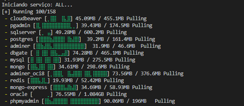
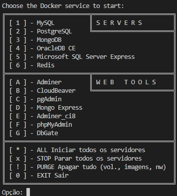

# (EN) SQL Lab in Docker, Jupyter, or VM
The main goal of this repository is to provide a testing and learning environment for relational and NoSQL databases, enabling users to:
1. Quickly install and configure multiple DBMSs (MySQL, PostgreSQL, MongoDB, OracleDB, Microsoft SQL Server, and Redis) using Docker;
1. Experiment and practice SQL in Jupyter Notebooks using libraries like JupySQL;
1. Run pre-configured environments in Virtual Machines for those who prefer not to use Docker;
1. Use Web tools and graphical clients for database administration without complex configurations.
This is, therefore, a portable database lab, ideal for learning, experimentation, teaching, and development.

In summary, it is aimed at developers, students, and teachers who need a complete database lab, allowing them to quickly install and experiment with various DBMSs in isolated environments. It is educational, modular, and oriented towards practical learning.

* 🐳 [Docker](#-system-preparation-for-running-in-docker)
* 📓 [Jupyter Notebook](#-system-preparation-for-running-in-jupyter-notebook)
* 🖥️ [Virtual Machine](#-system-preparation-for-running-in-virtual-machine)
* 🧰 [Other tools](#-tools-for-database-connection)


---
---

# 🐳 System preparation for running in Docker

The *docker-compose* files included in this repository provide different database scenarios and the respective administration tools to connect to those databases:

| File                           | Servers                        | Web Admin Tools                  |
|--------------------------------|--------------------------------|----------------------------------|
| **docker-compose-mysql.yml**     | MySQL                           | Adminer, phpMyAdmin, CloudBeaver |
| **docker-compose-postgres.yml**  | PostgreSQL                      | Adminer, pgAdmin, CloudBeaver    |
| **docker-compose-mongo.yml**     | MongoDB                         | Mongo Express                    |
| **docker-compose-oracle.yml**    | OracleDB CE (Community Edition) | Adminer_ci8, CloudBeaver         |
| **docker-compose-sqlserver.yml** | Microsoft SQL Server (Express)  | Adminer, CloudBeaver             |
| **docker-compose-redis.yml**     | Redis                           | DbGate                           |
| **docker-compose-ALL.yml**       | All of the above                | All of the above                 |


## Included servers

* 🐬 **[MySQL](https://www.mysql.com/)** — Relational DBMS (RDBMS)
* 🐘 **[PostgreSQL](https://www.postgresql.org/)** — Advanced relational DBMS (ORDBMS)
* 🍃 **[MongoDB](https://www.mongodb.com/)** — NoSQL document-oriented database (Document Store)
* 🔶 **[OracleDB CE](https://www.oracle.com/pt/database/technologies/appdev/xe.html)** — Enterprise relational DBMS, free *Community Edition* for testing and development
* 🟦 **[Microsoft SQL Server Express](https://www.microsoft.com/pt-br/sql-server/sql-server-downloads)** — Microsoft's relational DBMS, free *Express* version for development and small applications
* 🟥 **[Redis](https://redis.io/)** — In-memory NoSQL database, used for cache, queues, and key-value data storage


## Web administration tools

* 🛠️ **[Adminer](https://www.adminer.org/)** — Lightweight, single-file interface compatible with multiple DBMSs
* ☁️ **[CloudBeaver](https://github.com/dbeaver/cloudbeaver)** — Universal web interface from DBeaver, compatible with all DBMSs
* 🐘 **[pgAdmin](https://www.pgadmin.org/)** — Official PostgreSQL administration tool
* 🍃 **[Mongo Express](https://github.com/mongo-express/mongo-express)** — Lightweight interface for MongoDB
* 🐬 **[phpMyAdmin](https://www.phpmyadmin.net/)** — Classic interface for MySQL/MariaDB
* 🟧 **[DbGate](https://dbgate.io/)** — Web interface for SQL and NoSQL database administration (e.g., Redis, MongoDB)
* 🔴 **[RedisInsight](https://redis.com/redis-enterprise/redis-insight/)** — Graphical tool for Redis database administration and visualization

---
---

## 🛠️ Installation steps

### 0. Prerequisites

Make sure you have **Git**, **WSL** and **Docker Desktop** installed:

- 🐳 [Git](https://git-scm.com/downloads)
- 🐧 [WSL (Windows Subsystem for Linux)](https://learn.microsoft.com/en-us/windows/wsl/install)
- 🐙 [Docker Desktop](https://www.docker.com/get-started/)


**Windows:**
Alternatively, on Windows, you can install using **winget**:

```bash
wsl --install
wsl --update
winget update
winget install -e --id Git.Git
winget install -e --id Docker.DockerDesktop
```

**macOS:**
Alternatively, on macOS, you can install using **Homebrew**:

```bash
# Install Homebrew (if not already installed)
/bin/bash -c "$(curl -fsSL https://raw.githubusercontent.com/Homebrew/install/HEAD/install.sh)"

# Install Git and Docker Desktop
brew install git
brew install --cask docker
```

**Linux (Ubuntu/Debian):**
For Debian-based distributions, use **apt**:

```bash
# Update repositories
sudo apt update

# Install Git
sudo apt install git

# Install Docker
curl -fsSL https://get.docker.com -o get-docker.sh
sudo sh get-docker.sh
sudo usermod -aG docker $USER

# Restart session or run:
newgrp docker
```


### 1. Clone this repository
```bash
git clone https://github.com/jpedrodias/SQLab.git
cd SQLab
```
> Or, alternatively, just copy the desired `docker-compose-*.yml` files and the `.env` configuration file.


### 2. Start the docker container:
```bash
docker compose up
```
> To keep the services running, you need to keep the terminal open. To stop these services, just press `Ctrl+C`.

To start the services in the background, use the same command with the `-d` flag (detached mode):
```bash
docker compose up -d
```
> In this case, you don't need to keep the terminal open. To stop these background services, run `docker compose down` or stop them via Docker Desktop.


#### Extra - Server 1: MySQL
- To run the version with the MySQL database server, use:
>    ```bash
>    docker compose -f docker-compose-mysql.yml up
>    ```


#### Extra - Server 2: PostgreSQL
- To run the version with the PostgreSQL database server, use:
>    ```bash
>    docker compose -f docker-compose-postgres.yml up
>    ```

#### Extra - Server 3: MongoDB
- To run the version with the MongoDB database server, use:
>    ```bash
>    docker compose -f docker-compose-mongo.yml up
>    ```

#### Extra - Server 4: Oracle Database Express Edition
- To run the version with the Oracle database server, use:
>    ```bash
>    docker compose -f docker-compose-oracle.yml up
>    ```


#### Extra - Server 5: Microsoft SQL Server - Express
- To run the version with Microsoft SQL Server, use:
>    ```bash
>    docker compose -f docker-compose-sqlserver.yml up
>    ```


#### Extra - CloudBeaver (Universal Interface):
- To run only CloudBeaver (compatible with all DBMSs), use:
>    ```bash
>    docker compose -f docker-compose-cloudbeaver.yml up
>    ```
> CloudBeaver is the web version of the popular DBeaver and supports connections to MySQL, PostgreSQL, MongoDB, Oracle, SQL Server, and many other DBMSs in a single interface.


#### Extra - All servers:
- To run the version with all servers (and tools), use:
>    ```bash
>    docker compose -f docker-compose-ALL.yml up
>    ```
  


#### Extra - Menu to start services:

**Windows:**
- Alternatively, you can start any of the above services by running the `batch` file:
>    ```batch
>    .\run_in_docker.bat
>    ```

**Linux/macOS:**
- For Linux and macOS, use the equivalent `bash` script:
>    ```bash
>    chmod +x run_in_docker.sh
>    ./run_in_docker.sh
>    ```
(`chmod` adds permissions to execute the file)


**Extra:**
- Or, if you prefer to run a specific service directly:
>    ```bash
>    ./run_in_docker.sh mysql      # For MySQL
>    ./run_in_docker.sh postgres   # For PostgreSQL
>    ./run_in_docker.sh mongo      # For MongoDB
>    ./run_in_docker.sh ALL        # For all services
>    ```
> 
> 
> 


**Advanced:**
You can start a command line inside the service.
> In Docker Desktop, select the running service and then choose the "Exec" tab.

This is equivalent to running:
```bash
docker exec -it mysql_server    /bin/bash
docker exec -it postgres_server /bin/bash
docker exec -it mongodb_server  /bin/bash
docker exec -it oracle_server   /bin/bash
docker exec -it mssql_server    /bin/bash
```


### 3. Access credentials:
To access a database server using one of the included tools, the server **cannot** be `localhost` and must be the indicated server. 
However, for connection using other tools, for example, DBeaver, the `Server host` field should be `localhost`.


3.1. to server 1 - `MySQL`
```yml
Server: mysql or localhost
user: mysql_user
password: mysql_password
database: mydatabase
```
PS: In DBeaver, you may need to change a setting. In `Driver properties`, set `allowPublickeyRetrieval` from `false` to **`TRUE`**.


3.2. to server 2 - `PostgreSQL`
```yml
Server: postgres or localhost
user: postgres_user
password: postgres_password
database: mydatabase
```

3.3. to server 3 - `MongoDB`
```yml
Server: mongo or localhost
user: mongo_user
password: mongo_password
database: mydatabase
```

3.4. to server 4 - `Oracle Database Express Edition`
```yml
Server: oracle or localhost
user: system
password: oracle_password
database: mydatabase
```

3.5. to server 5 - `Microsoft SQL Server - Express`
```yml
Server: sqlserver or localhost
user: sa
password: mssql_Sup3rStrong3Password!
database: tempdb (or leave empty)
```


### 4. Web Clients (no additional installation required)
These included tools allow access to the database server without any additional installation. However, not all tools allow access to all databases.

|Tool         |Port |MySQL|Postgres|Oracle|MS SQL|MongoDB |Redis|Access |
|-------------|------|-----|--------|------|------|--------|-----|-------|
|Adminer      |[8081](http://localhost:8081)  |✅  |✅      |❌    |✅   |❌ |❌  | none |
|CloudBeaver  |[8082](http://localhost:8082)  |✅  |✅      |✅    |✅   |❌ |❌  | initial setup required |
|pgAdmin      |[8083](http://localhost:8083)  |❌  |✅      |❌    |❌   |❌ |❌  | user: `admin@admin.com`, pass: `admin` |
|Mongo Express|[8084](http://localhost:8084)  |❌  |❌      |❌    |❌   |✅ |❌  | user: `admin`, pass: `admin` |
|Adminer_ci8  |[8085](http://localhost:8085)  |❌  |❌      |✅    |❌   |❌ |❌  | none |
|phpMyAdmin   |[8086](http://localhost:8086)  |✅  |❌      |❌    |❌   |❌ |❌  | none |
|DbGate       |[8087](http://localhost:8087)  |✅  |✅      |✅    |✅   |✅ |✅  | none |


### 5. 🧹 Full Docker *cache* cleanup

Although Docker does not have as large a footprint as a traditional virtual machine, it is still a form of virtualization that can consume considerable disk space. In addition to downloaded images, Docker creates volumes, networks, and other artifacts that can accumulate.

Docker Desktop does not always show all resources in use. For better management, you can add an extension called [Portainer](https://www.portainer.io/) in Docker Desktop Extensions.

Or alternatively, you can perform a full *cache* cleanup using:

```bash
docker compose down
docker stop $(docker ps -aq)
docker rm $(docker ps -aq)
docker rmi $(docker images -q) -f
docker volume rm $(docker volume ls -q)
docker network prune -f
docker builder prune --all -f
docker system prune -a --volumes -f
```

> ℹ️ **Note:** Docker *volumes* store persistent data, such as database data.  
> ⚠️ **Warning:** Use these commands with caution, as they may delete important data that cannot be recovered.

---
---

# 📓 System preparation for running in Jupyter Notebook:
`JupySQL` allows you to run SQL commands and create charts from large datasets in Jupyter using the %sql, %%sql, and %sqlplot magics. JupySQL is compatible with all major databases (e.g., PostgreSQL, MySQL, SQL Server), data warehouses (like Snowflake, BigQuery, Redshift), and embedded engines (SQLite and DuckDB).

[see JupySQL](https://jupysql.ploomber.io/en/latest/quick-start.html)


```python
!pip install ipykernel jupyterlab jupysql --upgrade --no-cache-dir
!pip cache purge

%load_ext sql
%sql sqlite:///database.sqlite

%config SqlMagic.displaylimit = 0
%sql PRAGMA foreign_keys = ON
```

## a) Run Jupyter Online:
- [Google Colab](https://colab.research.google.com/)
- [Try Jupyter Lab](https://jupyter.org/try-jupyter/lab/)


## b) Run Jupyter locally on Windows:
```bash
python -m venv C:\TEMP\venvs\SQLab
C:\TEMP\venvs\SQLab\Scripts\Activate.ps1
pip install -r requirements.txt --upgrade --no-cache-dir
pip cache purge
```
PS: On Windows 11/10, there may be restrictions on running PowerShell `.ps1` scripts. In this case, you can disable this restriction or run `activate.bat` instead.

To disable script execution restrictions, open a terminal as administrator and run:
> ```bash
> Set-ExecutionPolicy -ExecutionPolicy RemoteSigned -Scope LocalMachine
> ```


## c) Run Jupyter locally on macOS/Linux:
```bash
python3 -m venv /tmp/SQLab
source /tmp/SQLab/bin/activate
pip install -r requirements.txt --upgrade --no-cache-dir
pip cache purge
```


---
---

# 🖥️ System preparation for running in a virtual machine:
- [Oracle Database Free VirtualBox Appliance](https://www.oracle.com/database/technologies/databaseappdev-vm.html) (from Oracle)
    - user: oracle or system, password: oracle
    - update:
    ```bash
    sudo dnf check-updates
    sudo dnf clean all
    ```
- ["Mint" Virtual Machine with MySql and Postgres](https://drive.google.com/file/d/15cBQOABUNHihoPV5I7NGLIcFw-IkJ3k7/view)
    - user: osboxes.org, password: osboxes.org
    - update/force update:
    ```bash
    sudo apt update -y && sudo apt upgrade -y && sudo apt full-upgrade -y && sudo apt dist-upgrade -y
    sudo apt autoclean -y && sudo apt autoremove -y
    ```
    - fix update failures:
    ```bash
    sudo apt -fix-missing install
    ```


---
---

# 🧰 Tools for database connection:
## a) Applications:
* [DBeaver](https://dbeaver.io/download/) - connect to different databases (sqlite, mysql, postgres, mongodb, oracle, etc)
* [sqlite3](https://www.sqlite.org/download.html) - command-line tool for sqlite
* [DB Browser for SQLite](https://sqlitebrowser.org/) - graphical tool for SQLite
* [pgAdmin](https://www.pgadmin.org/download/) - connect to PostgreSQL databases
* [MySQL Workbench](https://dev.mysql.com/downloads/workbench/) - connect to mysql/mariadb
* [SqlDbx](https://www.sqldbx.com/index.htm) - connect to different databases
* [MongoDB Compass](https://www.mongodb.com/try/download/compass) - connect to MongoDB
* [DbGate](https://dbgate.io/) - connect to SQL & NoSQL (e.g., MongoDB and Redis)
* [RedisInsight](https://redis.com/redis-enterprise/redis-insight/) - graphical tool for Redis database administration and visualization


## b) Web tools:
* 🛠️ **[Adminer](https://www.adminer.org/en/)** — Lightweight, single-file interface compatible with multiple DBMSs
* ☁️ **[CloudBeaver](https://cloudbeaver.io/)** — Universal web interface from DBeaver, compatible with all DBMSs
* 🐘 **[pgAdmin](https://www.pgadmin.org/download/pgadmin-4-container/)** — Official PostgreSQL administration tool
* 🍃 **[Mongo Express](https://github.com/mongo-express/mongo-express)** — Lightweight interface for MongoDB
* 🐬 **[phpMyAdmin](https://www.phpmyadmin.net/)** — Classic interface for MySQL/MariaDB
* 🟧 **[DbGate](https://dbgate.io/)** — Web interface for SQL and NoSQL database administration (e.g., Redis, MongoDB)

## c) other web tools:
* [draw.io](https://draw.io) - Draw ERD (Entity-Relationship Diagrams)
* [mockaroo](https://mockaroo.com/) - Generate random data
* [SandboxSQL](https://sandboxsql.com/) - Online environment to practice SQL with real databases
* [dbdiagram.io](https://dbdiagram.io) - Draw ERD (Entity-Relationship Diagrams)
* [SQLiteOnline](https://sqliteonline.com/) - Online editor to test SQL in SQLite, PostgreSQL, MySQL, and others


---
---
end of file: (EN) SQL Lab in Docker, Jupyter, or VM